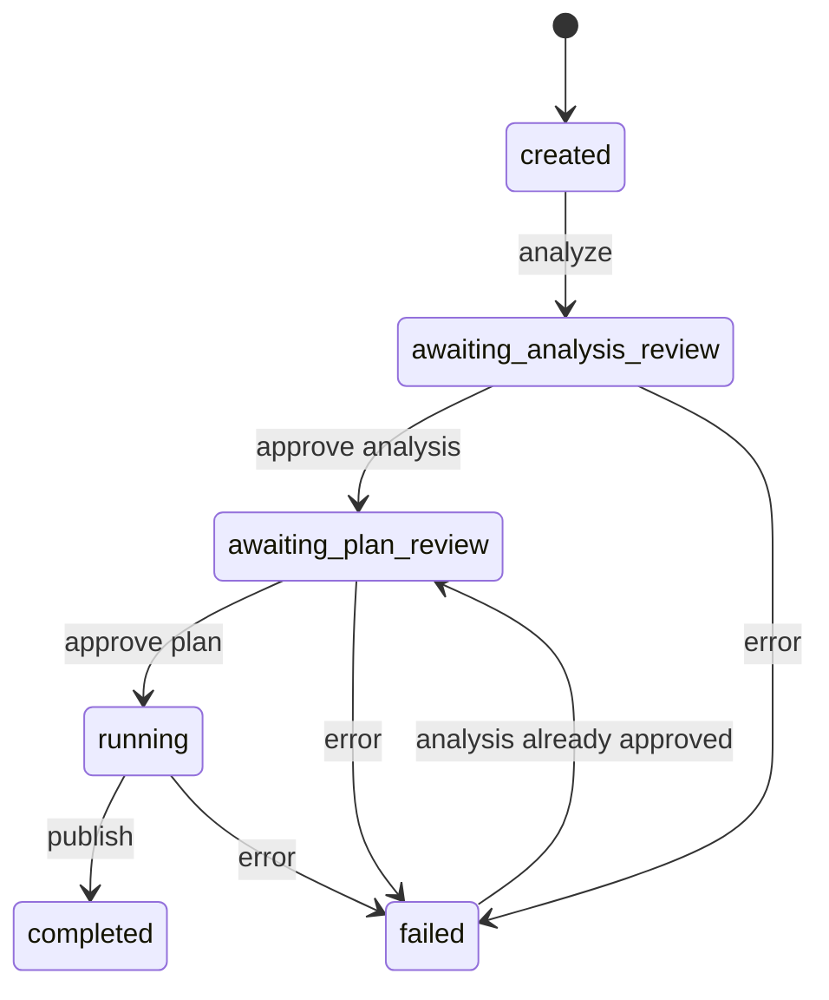
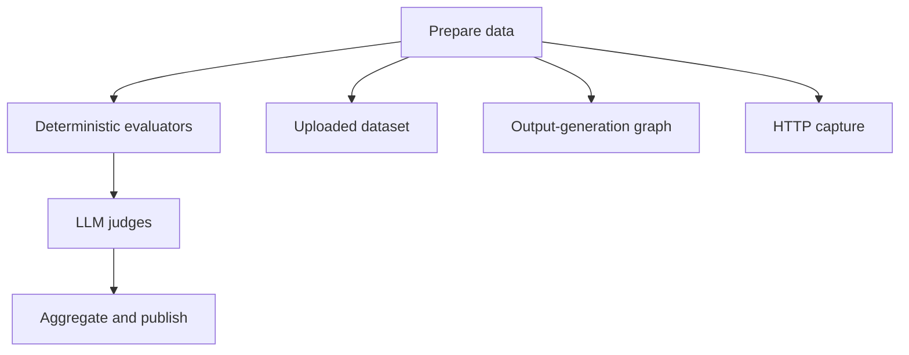

# Architecture

The factory is a guided evaluation pipeline. A reviewer approves the architecture and the metric plan before any score is produced. The same graph evaluates a RAG pipeline, a chatbot, or an agent.


## Containers

```mermaid
flowchart LR
  ui["React workspace"] --> api["FastAPI /api"]
  api --> service["Evaluation service"]
  service --> store["Run store"]
  service --> graph["LangGraph"]
  graph --> providers["LLM providers"]
  graph --> files["report.md and charts"]
  store --> files
```

| Piece | Role |
| --- | --- |
| React workspace | Routes `/` and `/runs/:id`. Uploads artifacts, edits the analysis and plan, and shows the report. Vite proxies `/api` to the API. |
| FastAPI | Translates HTTP into service calls. `FactoryError` becomes JSON `{detail}`. |
| Evaluation service | Owns phase gates. Artifacts lock after analysis approval. Plan edits lock after the plan is approved, unless the run failed and plan review reopens. |
| LangGraph | Nodes are `analyze`, `plan`, `prepare`, `evaluate_deterministic`, `evaluate_judges`, and `publish`. The compiled graph interrupts after `analyze` and `plan`. |
| Run store | `data/{run_id}/run.json`, written by replacing a temp file. Artifacts live under `artifacts/`. Charts live under `charts/`. |
| LLM providers | `heuristic` by default. Also `openai`, `anthropic`, and `openai_compatible`. Keys are read from the environment and are not stored on the run. |

## How a run advances

Each advance starts a new graph thread. The router reads the saved run and chooses the next node. The in-memory checkpoint does not decide that.



Routing rules:

1. A completed run stops.
2. A run with no analysis goes to `analyze`.
3. An unapproved analysis stops, which is the first review.
4. A run with no metric plan goes to `plan`.
5. An unapproved plan stops, which is the second review.
6. Otherwise the run enters `prepare` and continues through scoring and publish.

`analyze` is wired to `plan`, and `plan` is wired to `prepare`, but the interrupts fire before those edges run. The next HTTP call is what continues the graph.

## Inside one completed invoke



Prepare uses a supplied dataset, synthesizes one, or fills missing outputs by calling the system under test. Synthesis is its own graph: propose cases, draft outputs, validate the pair. Capture is an HTTP POST or GET. The body template accepts `{{input}}`, `{{expected}}`, `{{context}}`, and `{{case_id}}`. Redirects are not followed. Link-local and cloud metadata hosts are rejected. Loopback and private addresses are allowed.

Deterministic evaluators run in a thread pool, at most eight workers, and results are sorted by case and metric. Judges run one case and one metric at a time. Publish writes `report.md` and four HTML charts:

- `score-by-metric-YYYY-MM-DD.html`
- `mode-comparison-YYYY-MM-DD.html`
- `case-risk-YYYY-MM-DD.html`
- `case-heatmap-YYYY-MM-DD.html`

The date is the run's `updated_at` in local time. Chart HTML loads Plotly from a CDN.

## Package map

```text
backend/eval_factory/
  domain/        run model and the ontology
  artifacts/     PDF, Markdown, JSON, YAML, DOCX, image, text
  analysis/      solution analyzer
  planning/      metric plan, rule bundles, rubrics
  data/          datasets, synthesis graph, API capture
  evaluators/    coded checks and judges
  scoring/       weighted aggregate and risk
  reporting/     Markdown and Plotly
  workflow/      LangGraph and the service
  api/           FastAPI routes
frontend/        guided review UI
examples/        sample RAG artifact and dataset
```
